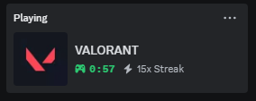
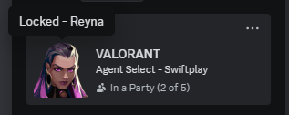
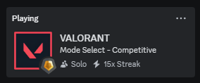
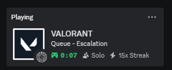
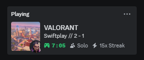

# VALORANT Discord Rich-Presence (RPC)

[![Releases][releases-shield]][releases-url]
[![Stars][stars-shield]][stars-url]
[![Language][language-shield]][language-url]
[![License][license-shield]][license-url]

## About
  VALORANT Discord Rich-Presence (RPC) gathers real-time ingame information and display it on your Discord Profile, replacing the boring default Discord status! **This is a heavy fork/continuation of [colinhartigan's RPC](https://github.com/colinhartigan/valorant-rpc), which is now unmaintained and archived. This project aims to maintain it and add new features for the forseeable feature.** Unfinished features have been removed, including configuration window and the command line window that appears on run. 
  
Some newly added features and fixes added by me:
  - New Maps & Agents now supported
  - New Gamemodes now supported (Premier ingame functionality not guaranteed, as I haven't had a chance to play Premier with this yet)
  - All icons updated to their latest
  - Automatic updater
  - Custom games now dynamically update their information (agents, gamemode etc)
  - and much more!

Before (Default):

<a>
  
<a/>

After (RPC):

  

## Installation
  - Download the latest [release](https://github.com/KEA12/valorant-rpc/releases/latest)
  - Replace your VALORANT Shortcut with the .exe (to barely change the way you usually launch VALORANT)

## How to use
  - Launch the downloaded .exe instead of VALORANT
  - If VALORANT is already opened, you can still run the .exe and it will overtake your Discord status
  - The program automatically exits once the VALORANT process is closed

## Issues or Problems
  - Make an [issue](https://github.com/KEA12/valorant-rpc/issues) or feel free to open a [pull request](https://github.com/KEA12/valorant-rpc/pulls) :)

## Can I get banned?
  - No! The program does not give you any advantage whatsoever and does not modify the game process or files. You only have access to already known information.

## Disclaimer
 This project is not affiliated with Riot Games or any of its employees and therefore does not reflect the views of said parties.
 
 Riot Games does not endorse or sponsor this project. Riot Games, and all associated properties are trademarks or registered trademarks of Riot Games, Inc.
 This project was created under Riot Games' ["Legal Jibber Jabber"](https://www.riotgames.com/en/legal) policy using assets owned by Riot Games.

[stars-shield]: https://img.shields.io/github/stars/KEA12/valorant-rpc?style=for-the-badge&logo=github
[stars-url]: https://github.com/KEA12/valorant-rpc/stargazers
[releases-shield]: https://img.shields.io/github/downloads/KEA12/valorant-rpc/total?style=for-the-badge
[releases-url]: https://github.com/KEA12/valorant-rpc/releases
[license-shield]: https://img.shields.io/github/license/KEA12/valorant-rpc?style=for-the-badge
[license-url]: https://github.com/KEA12/valorant-rpc/blob/v3/LICENSE.txt
[language-shield]: https://img.shields.io/github/languages/top/KEA12/valorant-rpc?logo=python&logoColor=yellow&style=for-the-badge
[language-url]: https://www.python.org/

